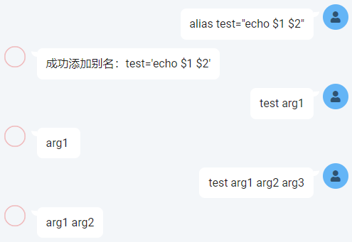
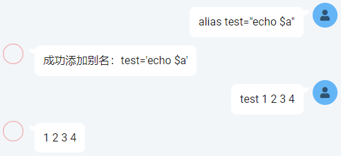

# nonebot-plugin-alias

为 [nonebot2](https://github.com/nonebot/nonebot2) 的指令创建别名

### 使用

**以下命令需要加[命令前缀](https://v2.nonebot.dev/docs/api/config#Config-command_start) (默认为`/`)，可自行设置为空**

- `alias [别名]=[指令名称]` 添加别名
- `alias [别名]` 查看别名
- `alias -p` 查看所有别名
- `unalias [别名]` 删除别名
- `unalias -a` 删除所有别名

默认只在当前群聊/私聊中生效，使用 `-g` 参数添加全局别名；增删全局别名需要超级用户权限

- `alias -g [别名]=[指令名称]` 添加全局别名
- `unalias -g [别名]` 删除全局别名

### 示例

  
  

### 传入参数

可以用 bash shell 的风格在别名中使用参数，如：`alias test="echo $1"`

`$1` 表示第一个参数，以此类推；`$a` 表示所有参数

**当创建别名的命令中包含 `$` 符号时，即认为使用了参数。**

**此时，别名之后的内容会以参数方式解析，而不仅仅是替换别名**

使用 [expandvars](https://github.com/sayanarijit/expandvars) 来解析参数，可实现参数默认值、切片等功能：

- `alias test="echo ${1:-default}"`
- `alias test="echo ${1:0:4}"`

由于 expandvars 还未实现 shell 所有的变量扩展特性，具体可用的功能可以查看该项目

### 传参示例

